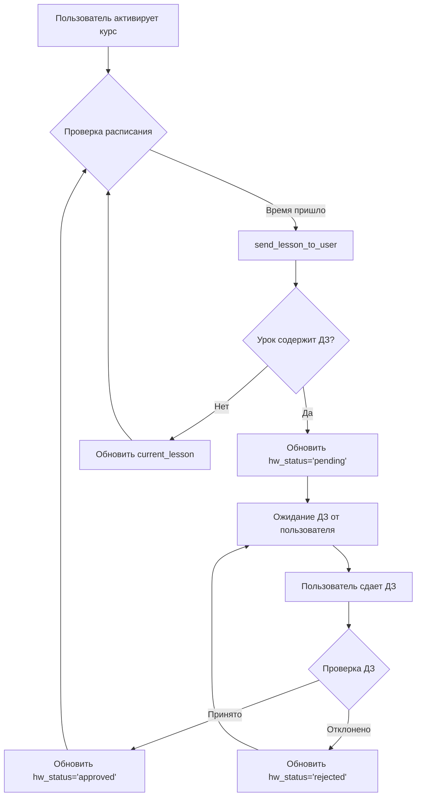
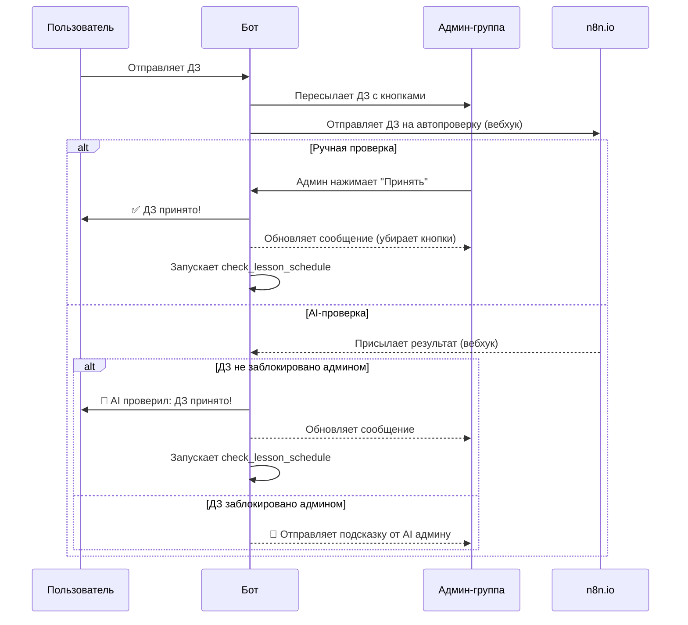

# AntBot - Telegram-бот для образовательных курсов

## Описание

AntBot - это многофункциональный Telegram-бот, разработанный для автоматизации и управления образовательными курсами. Он позволяет пользователям активировать курсы, получать уроки по расписанию, отправлять домашние задания на проверку (в том числе с помощью AI) и взаимодействовать со службой поддержки.

--- 

## 🚀 Основные возможности

### Для пользователей:
- **Активация курсов:** Простая активация доступа к курсу с помощью уникального кодового слова.
- **Получение уроков:** Автоматическая доставка уроков из закрытого Telegram-канала по заданному расписанию.
- **Отслеживание прогресса:** Возможность в любой момент посмотреть свой текущий статус и следующий урок.
- **Отправка домашних заданий:** Удобный интерфейс для отправки выполненных заданий на проверку.
- **Поддержка:** Прямая линия связи с администраторами и экспертами через бота.

### Для администраторов:
- **Управление курсами:** Гибкая настройка курсов, уроков и тарифов (версий курса).
- **Проверка домашних заданий:** Централизованный интерфейс в админ-группе для проверки работ студентов с возможностью привлечения AI-ассистента для предварительной оценки.
- **Коммуникация:** Ответы на запросы пользователей в режиме поддержки.
- **Интеграция с n8n:** Вебхуки для интеграции с сервисом автоматизации n8n для обработки ДЗ и ответов экспертов.

--- 

## 🛠️ Установка и запуск

### Требования
- Python 3.11+
- Зависимости, перечисленные в `requirements.txt`

### Настройка

1.  **Клонируйте репозиторий:**
    ```bash
    git clone https://github.com/andrjur/antbot3
    cd antbot3
    ```

2.  **Установите зависимости:**
    ```bash
    pip install -r requirements.txt
    ```

3.  **Настройте переменные окружения:**
    Создайте файл `.env` в корне проекта по примеру `.env.example` и заполните его своими данными:
    ```env
    # Токен вашего Telegram-бота
    BOT_TOKEN=123456:ABC-DEF1234567890

    # ID администраторов через запятую
    ADMIN_IDS=777000,123456

    # ID основной администраторской группы
    ADMIN_GROUP_ID=-1001234567890

    # URL для вебхуков n8n
    N8N_HOMEWORK_CHECK_URL=https://your-n8n-instance.com/webhook/homework-check
    N8N_ASK_EXPERT_URL=https://your-n8n-instance.com/webhook/ask-expert

    # Секретные ключи для защиты вебхуков
    N8N_WEBHOOK_SECRET=your_secret_for_outgoing_webhooks
    N8N_CALLBACK_SECRET=your_secret_for_incoming_callbacks

    # Настройки для работы бота через вебхуки (рекомендуется для продакшена)
    BASE_WEBHOOK_URL=https://your-domain.com
    WEBHOOK_SECRET_TOKEN=your_super_secret_token_for_telegram
    WEB_SERVER_PORT=8080
    ```

4.  **Настройте курсы:**
    Отредактируйте файл `settings.json`, чтобы определить ваши курсы, тарифы и коды активации.

5.  **Запустите бота:**
    ```bash
    python main.py
    ```

--- 

## ⚙️ Конфигурация контента

### Разметка уроков в канале

Для того чтобы бот мог корректно парсить уроки из вашего Telegram-канала, используйте специальную разметку. Каждое сообщение с уроком должно начинаться и заканчиваться определенными тегами.

**Пример разметки:**

```
*START_LESSON 1*
Текст первого урока...
*END_LESSON 1*
```

```
*START_LESSON 2*
Текст второго урока...
*HW_START*
Текст домашнего задания...
*HW_END*
*END_LESSON 2*
```

- `*START_LESSON <номер>*`: Начало блока урока.
- `*END_LESSON <номер>*`: Конец блока урока.
- `*HW_START*`: Начало блока домашнего задания.
- `*HW_END*`: Конец блока домашнего задания.
- `*COURSE_END*`: Специальный тег, который означает конец всего курса. Его получение инициирует завершение курса для пользователя.

### Конфигурация курсов (`settings.json`)

Этот файл является центром управления вашими курсами.

- **`groups`**: Сопоставление ID каналов с контентом и их названий.
- **`tariff_names`**: Человекочитаемые названия для версий курсов (например, `v1: "Базовый"`).
- **`activation_codes`**: Слова-ключи для активации курсов, привязанные к конкретному курсу, тарифу и цене.

--- 

## 🏗️ Структура проекта (план рефакторинга)

Текущая структура проекта представляет собой один большой файл `main.py`. В планах провести рефакторинг для улучшения модульности и поддержки.

```
. 
├── .env # Переменные окружения
├── bot.db # База данных SQLite
├── main.py # Основной файл бота (текущее состояние)
├── populate_tasks.py # Скрипт для наполнения БД
├── README.md # Этот файл
├── requirements.txt # Зависимости
└── settings.json # Настройки курсов
```

---

## 🔬 Описание функций (`main.py`)

Этот раздел содержит подробное описание ключевых функций, используемых в боте.

### Настройка и инициализация

- **`setup_logging()`**
  - **Что делает:** Настраивает систему логирования для записи событий в файл `bot.log` и вывода в консоль. Использует `RotatingFileHandler` для ротации логов при достижении размера 500 КБ. Применяет кастомный `LocalTimeFormatter` для отображения времени в часовом поясе 'Europe/Moscow'.
  - **Откуда вызывается:** Вызывается один раз при старте бота.

- **`load_settings()`**
  - **Что делает:** Загружает конфигурацию из файла `settings.json`. В случае успеха, асинхронно запускает `populate_course_versions()` для наполнения таблицы с тарифами.
  - **Откуда вызывается:** Вызывается один раз при старте бота в функции `main()`.

- **`init_db()`**
  - **Что делает:** Инициализирует базу данных `bot.db`. Создает все необходимые таблицы (`users`, `courses`, `user_courses`, `group_messages` и др.), если они не существуют. Использует `PRAGMA journal_mode = WAL` для повышения производительности.
  - **Откуда вызывается:** Вызывается один раз при старте бота в функции `main()`.

### Работа с курсами и пользователями

- **`activate_course(user_id, activation_code, level)`**
  - **Что делает:** Активирует курс для пользователя по кодовому слову. Логика включает:
    1.  Поиск кода в БД.
    2.  Проверку, есть ли у пользователя уже активный курс.
    3.  Если активен тот же тариф — сообщает об этом.
    4.  Если активен другой тариф — производит смену тарифа, сбрасывая прогресс.
    5.  Если курс был неактивен — активирует его.
    6.  Логирует действие и отправляет уведомление администраторам.
  - **Откуда вызывается:** Обработчик команды `/activate`.

- **`deactivate_course(user_id, course_id)`**
  - **Что делает:** Устанавливает статус курса 'inactive' для пользователя и останавливает для него задачу проверки расписания уроков (`stop_lesson_schedule_task`).
  - **Откуда вызывается:** Обработчик колбэка `stop_course`.

- **`send_lesson_to_user(user_id, course_id, lesson_num, repeat, level)`**
  - **Что делает:** Основная функция для отправки уроков.
    1.  Проверяет, не является ли урок последним. Если да — вызывает `_handle_course_completion`.
    2.  Получает контент урока из БД (`_get_lesson_content_from_db`).
    3.  Отправляет все части урока пользователю (`_send_lesson_parts`), пропуская те, что не соответствуют уровню пользователя.
    4.  Обновляет прогресс пользователя в БД (`_update_user_course_after_lesson`).
    5.  Отправляет пользователю главное меню с актуальными кнопками.
  - **Откуда вызывается:** `check_lesson_schedule()` (основной вызов), а также обработчики повтора уроков.

- **`check_lesson_schedule(user_id, hours, minutes)`**
  - **Что делает:** Периодически проверяет, пора ли отправлять следующий урок пользователю.
    1.  Получает статус активного курса пользователя.
    2.  Проверяет, не ожидает ли бот домашнее задание (`hw_status`).
    3.  Рассчитывает время следующего урока на основе времени отправки первого урока и интервала.
    4.  Если время пришло — вызывает `send_lesson_to_user`.
    5.  Если время не пришло — обновляет сообщение с меню, показывая, когда будет следующий урок.
  - **Откуда вызывается:** `scheduled_lesson_check()`, которая запускается в виде фоновой задачи для каждого активного пользователя.

### Обработчики команд и состояний (FSM)

- **`start(message: Message, state: FSMContext)`**
  - **Команда:** `/start`
  - **Что делает:** Регистрирует нового пользователя в БД или обновляет его данные. Отправляет приветственное сообщение и главное меню (`send_main_menu_for_user`), в котором отображаются активные курсы или предложение активировать новый.

- **`show_my_courses(message: Message)`**
  - **Команда:** `/mycourses`
  - **Что делает:** Показывает пользователю список его активных и завершенных курсов с кнопками для взаимодействия (перейти к курсу, посмотреть описание).

- **`activate_command(message: Message, state: FSMContext)`**
  - **Команда:** `/activate`
  - **Что делает:** Запрашивает у пользователя код активации, переводя его в состояние `waiting_for_activation_code`.

- **`process_activation_code(message: Message, state: FSMContext)`**
  - **Состояние:** `waiting_for_activation_code`
  - **Что делает:** Получает введенный код, вызывает `activate_course()` для его проверки и активации. Отправляет результат пользователю.

- **`cmd_support_callback(query: CallbackQuery, state: FSMContext)`**
  - **Колбэк:** `menu_support`
  - **Что делает:** Переводит пользователя в состояние `SupportRequest.waiting_for_message`, чтобы он мог отправить сообщение в службу поддержки.

- **`process_support_message(message: Message, state: FSMContext)`**
  - **Состояние:** `SupportRequest.waiting_for_message`
  - **Что делает:** Пересылает сообщение пользователя в администраторскую группу, добавляя к нему кнопку "Ответить".

### Обработка домашних заданий

- **`process_homework(message: Message, state: FSMContext)`**
  - **Состояние:** `AwaitingHomework.waiting_for_homework`
  - **Что делает:** Принимает домашнее задание от пользователя. Пересылает его в админ-группу для проверки, снабдив кнопками "Принять" и "Отклонить". Отправляет данные в n8n через вебхук `N8N_HOMEWORK_CHECK_URL` для автоматической проверки.

- **`cb_admin_approve_hw(query: CallbackQuery, callback_data: AdminHomeworkCallback)`**
  - **Колбэк:** `admin_hw:approve_hw`
  - **Что делает:** Обрабатывает нажатие админом кнопки "Принять". Вызывает `handle_homework_result()` с флагом `is_approved=True`.

- **`handle_homework_result(user_id, course_id, ..., is_approved, ...)`**
  - **Что делает:** Центральная функция для обработки результатов проверки ДЗ (как от админа, так и от n8n). 
    1.  Отправляет студенту уведомление о том, принято его ДЗ или нет, вместе с комментарием.
    2.  Обновляет статус ДЗ (`hw_status`) в БД на `approved` или `rejected`.
    3.  Если ДЗ принято, запускает проверку расписания (`check_lesson_schedule`), чтобы отправить следующий урок.
    4.  Удаляет сообщение с кнопками проверки из админ-чата.
  - **Откуда вызывается:** `cb_admin_approve_hw`, `cb_admin_reject_hw`, `handle_n8n_hw_approval`.

- **`handle_n8n_hw_approval(request: web.Request)`**
  - **Вебхук:** `/n8n_hw_approval`
  - **Что делает:** Принимает результат проверки ДЗ от n8n. Если работа не заблокирована админом, вызывает `handle_homework_result` для обработки. Если админ уже начал проверку, отправляет результат от AI как подсказку в тред.

### Администрирование и вебхуки

- **`admin_panel(message: Message)`**
  - **Команда:** `/admin` (только для админов)
  - **Что делает:** Открывает административную панель с кнопками для управления курсами, просмотра статистики и других административных действий.

- **`process_new_content(message: Message)`**
  - **Что делает:** Это основной обработчик сообщений из привязанных каналов с контентом. Он парсит текст сообщения, ищет теги (`*START_LESSON*`, `*HW_START*` и т.д.) и сохраняет контент уроков и домашних заданий в базу данных (`group_messages`).
  - **Откуда вызывается:** Срабатывает на любое сообщение в каналах, ID которых указаны в `settings.json`.

- **`require_n8n_secret(handler)`**
  - **Что делает:** Декоратор для вебхуков, который проверяет наличие и правильность секрета (`N8N_CALLBACK_SECRET`) в заголовках запроса. Защищает эндпоинты от несанкционированного доступа.
  - **Откуда вызывается:** Применяется к функциям-обработчикам вебхуков от n8n (`handle_n8n_hw_approval`, `handle_n8n_expert_answer`).

- **`main()`**
  - **Что делает:** Главная асинхронная функция, запускающая бота. Выполняет следующие шаги:
    1.  Загружает переменные окружения.
    2.  Настраивает логирование.
    3.  Инициализирует базу данных (`init_db`).
    4.  Загружает настройки (`load_settings`).
    5.  Настраивает и запускает веб-сервер `aiohttp` для приема вебхуков от Telegram и n8n.
    6.  Запускает `dp.start_polling()` для получения обновлений от Telegram.
  - **Откуда вызывается:** Запускается при исполнении файла `python main.py`.

---

## 📊 Диаграммы рабочих процессов

### 1. Жизненный цикл урока



### 2. Процесс проверки домашнего задания



## 📜 Лицензия

Проект распространяется под лицензией MIT.

---

## 🧐 Архитектурные заметки и точки роста

Этот раздел предназначен для будущих разработчиков. Здесь описаны текущие архитектурные решения, их компромиссы и предложения по улучшению и масштабированию.

### Спорные решения и "узкие места"

1.  **Монолитный `main.py`:** Все хендлеры, утилиты и логика находятся в одном файле. Это упрощает запуск, но усложняет навигацию и поддержку. **Предложение:** Провести рефакторинг, разбив код на модули (`handlers`, `keyboards`, `db`, `utils`), как было предложено ранее.

2.  **Глобальные переменные:** Использование глобальных переменных (`settings`, `lesson_check_tasks`) может привести к трудноотлавливаемым ошибкам. **Предложение:** Передавать зависимости (например, объект конфига) через middleware в `aiogram` или явно в функции.

3.  **Парсинг контента через RegEx:** Функция `process_new_content` использует регулярные выражения для парсинга уроков. Это работает, но хрупко. Опечатка в теге `*START_LESSON*` может сломать импорт. **Предложение:** Разработать более строгий формат, например, JSON или YAML, для описания структуры курса, который будет загружаться администратором через специальную команду.

4.  **Фоновая задача на каждого пользователя:** `scheduled_lesson_check` запускается как отдельная задача `asyncio` для каждого активного пользователя. Это простое решение, но оно плохо масштабируется. **Предложение:** Использовать один глобальный планировщик (например, `apscheduler`), который раз в минуту проверяет *всех* пользователей, у кого подошло время отправки урока.

5.  **Блокировка ДЗ в памяти:** Словарь `HOMEWORK_BEING_PROCESSED` для блокировки проверяемых ДЗ хранится в памяти. При перезапуске бота эта информация теряется. **Предложение:** Перенести логику блокировки в БД, добавив поле `locked_by_admin_id` и `locked_at` в таблицу `pending_admin_homework`.

### Анализ производительности и план масштабирования

- **До 100 одновременных пользователей:**
  - **Поведение:** Текущая архитектура на `SQLite` + `asyncio` справится без проблем. Основная нагрузка — I/O операции с базой данных и Telegram API.
  - **Оптимизация:** Не требуется.

- **100 - 5,000 пользователей:**
  - **Поведение:** `SQLite` начнет становиться "узким местом", особенно из-за блокировок на запись (`database is locked`). Количество фоновых задач `scheduled_lesson_check` может начать потреблять заметное количество памяти.
  - **Оптимизация:**
    1.  **Переход на PostgreSQL:** Заменить `aiosqlite` на `asyncpg`. PostgreSQL значительно лучше справляется с параллельными подключениями и записью.
    2.  **Централизованный планировщик:** Заменить индивидуальные задачи на `apscheduler`.

- **5,000 - 50,000 пользователей:**
  - **Поведение:** Один инстанс бота может не справляться с обработкой всех запросов и рассылок. Telegram API может начать возвращать ошибки `429 Too Many Requests`.
  - **Оптимизация:**
    1.  **Очередь задач (Celery/Redis):** Вынести тяжелые или длительные операции в фоновые воркеры. Кандидаты:
        - Рассылка уроков (`send_lesson_to_user`).
        - Обращение к внешним API (n8n).
        - Обработка медиафайлов.
    2.  **Кэширование:** Использовать Redis для кэширования часто запрашиваемых данных (профили пользователей, структура курсов), чтобы снизить нагрузку на БД.

- **Более 100,000 пользователей:**
  - **Поведение:** Монолитная архитектура достигает своего предела. Требуется горизонтальное масштабирование.
  - **Оптимизация (Микросервисы):**
    1.  **Разделение на сервисы:** Распилить монолит на несколько независимых сервисов, общающихся через брокер сообщений (например, RabbitMQ или Kafka).
        - **`Gateway Service`:** Принимает все обновления от Telegram, валидирует и отправляет в очередь.
        - **`Scheduler Service`:** Отвечает за рассылку уроков по расписанию.
        - **`Homework Service`:** Обрабатывает сдачу и проверку ДЗ.
        - **`Core Service`:** Управляет логикой курсов, пользователей и т.д.
    2.  **База данных:** Использовать репликацию БД (read-replicas) для распределения нагрузки на чтение.

### Развертывание (Deployment)

- **Простой вариант (до 1000 пользователей):**
  - Один виртуальный сервер (VPS).
  - Бот запускается как `systemd` сервис для автоматического перезапуска.
  - PostgreSQL установлен на том же сервере.
  - Для вебхуков используется `nginx` в качестве обратного прокси.

- **Масштабируемый вариант (от 5000 пользователей):**
  - **Docker и Docker Compose:** Упаковать бота и его зависимости (PostgreSQL, Redis) в Docker-контейнеры. `docker-compose.yml` для оркестрации на одном хосте.
  - **Kubernetes (K8s):** Для максимальной масштабируемости и отказоустойчивости. Каждый микросервис развертывается как отдельный `Deployment` в кластере K8s, что позволяет независимо масштабировать компоненты, которые испытывают наибольшую нагрузку.
